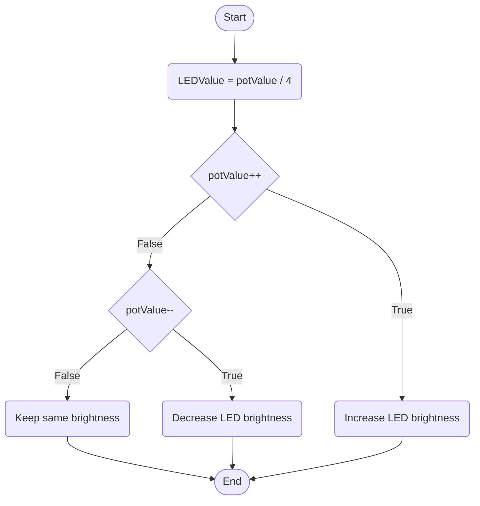
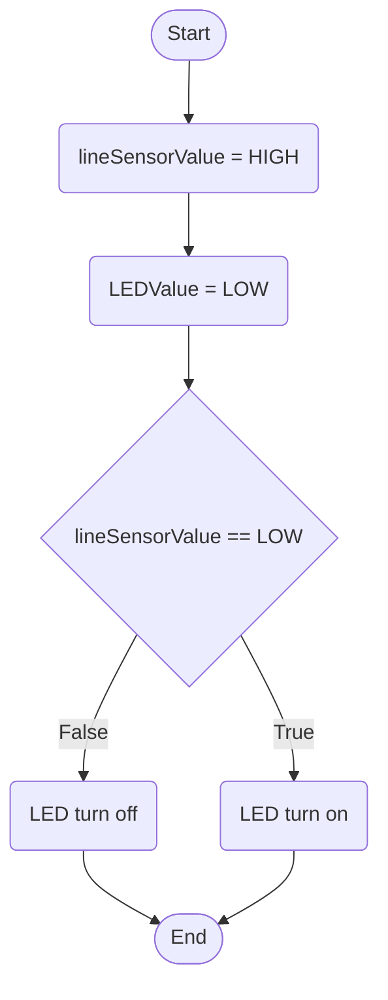
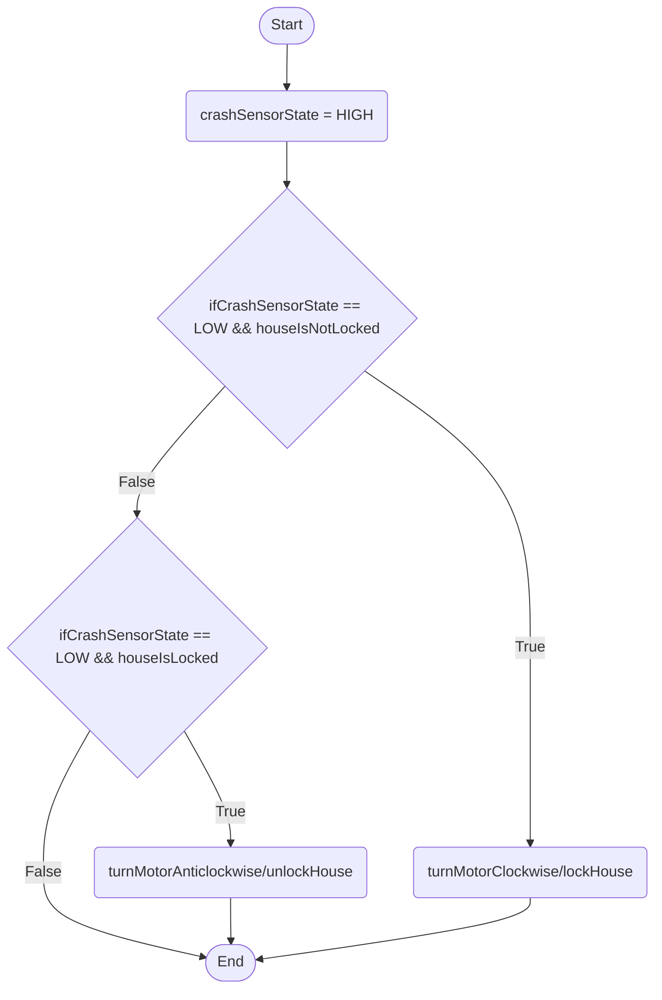
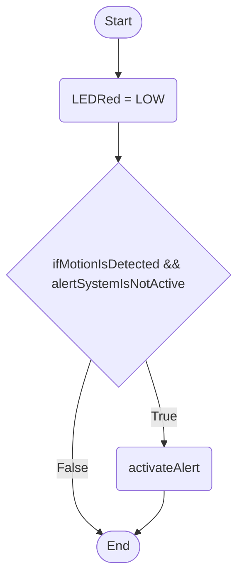

# Programming Logic

## Customizable lighting

```mermaid
flowchart TD
    terminalStart([Start])
    terminalEnd([End])
    LEDValue(LEDValue = potValue / 4)
    increaseLEDBrightness(Increase LED brightness)
    decreaseLEDBrightness(Decrease LED brightness)
    sameLEDBrightness(Keep same brightness)

    ifPotValue++{potValue++}

    ifFalse{potValue--}


    terminalStart --> LEDValue
    LEDValue --> ifPotValue++
    ifPotValue++ --> |True| increaseLEDBrightness
    ifPotValue++ --> |False| ifFalse
    ifFalse --> |True| decreaseLEDBrightness
    ifFalse --> |False| sameLEDBrightness
    sameLEDBrightness --> terminalEnd
    decreaseLEDBrightness --> terminalEnd
    increaseLEDBrightness --> terminalEnd
```
## Parcel detector

```mermaid
  flowchart TD
    terminalStart([Start])
    terminalEnd([End])
    lineSensorValue(lineSensorValue = HIGH)
    LEDValue(LEDValue = LOW)
    LEDTurnOn(LED turn on)
    LEDTurnOff(LED turn off)
    
    ifLineSensorValueIsLow{lineSensorValue == LOW}


    terminalStart --> lineSensorValue
    lineSensorValue --> LEDValue
    LEDValue --> ifLineSensorValueIsLow
    ifLineSensorValueIsLow --> |True| LEDTurnOn
    ifLineSensorValueIsLow --> |False| LEDTurnOff
    LEDTurnOff --> terminalEnd
    LEDTurnOn --> terminalEnd


```

## House Lockdown

```mermaid
  flowchart TD
    terminalStart([Start])
    terminalEnd([End])
    crashSensorState(crashSensorState = HIGH)
    lockHouse(turnMotorClockwise/lockHouse)
    unlockHouse(turnMotorAnticlockwise/unlockHouse)

    ifCrashSensorState{ifCrashSensorState == LOW && houseIsNotLocked}

    ifCrashSensorState2{ifCrashSensorState == LOW && houseIsLocked}

    terminalStart --> crashSensorState
    crashSensorState --> ifCrashSensorState
    ifCrashSensorState --> |True| lockHouse
    ifCrashSensorState --> |False| ifCrashSensorState2
    ifCrashSensorState2 --> |True| unlockHouse
    ifCrashSensorState2 --> |False| terminalEnd
    unlockHouse --> terminalEnd
    lockHouse --> terminalEnd


```
## Motion Sensor Alert

```mermaid
  flowchart TD
    terminalStart([Start])
    terminalEnd([End])
    LEDRed(LEDRed = LOW)
    PIRIsActive(activateAlert)

    isMotionDetected{ifMotionIsDetected && alertSystemIsNotActive}


    terminalStart --> LEDRed
    LEDRed --> isMotionDetected
    isMotionDetected --> |True| PIRIsActive
    isMotionDetected --> |False| terminalEnd
    PIRIsActive --> terminalEnd
```