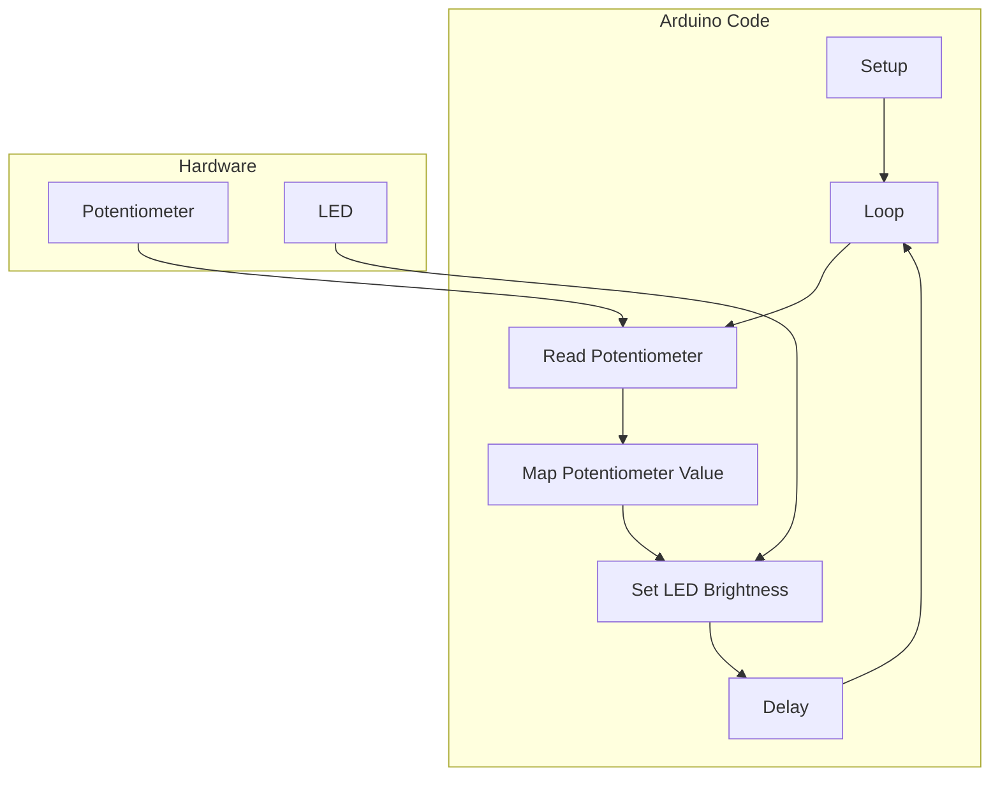
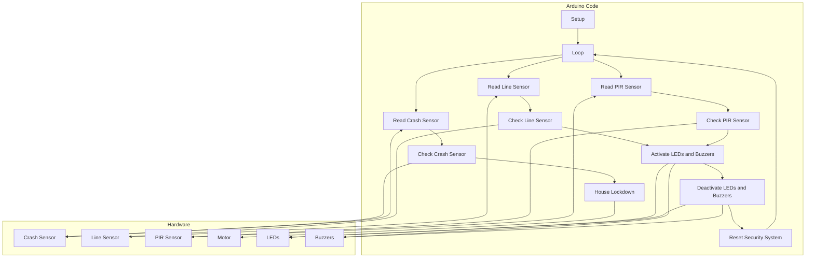

# Programming Logic

## Customizable lighting

```mermaid
flowchart TB
    subgraph Arduino Code
        A[Setup]
        B[Loop]
        C[Read Potentiometer]
        D[Map Potentiometer Value]
        E[Set LED Brightness]
        F[Delay]
        A --> B
        B --> C
        C --> D
        D --> E
        E --> F
        F --> B
    end

    subgraph Hardware
        G[Potentiometer]
        H[LED]
        G --> C
        H --> E
    end
```

## Security system

```mermaid
flowchart TB
    subgraph Arduino Code
        A[Setup]
        B[Loop]
        C[Read Crash Sensor]
        D[Read Line Sensor]
        E[Read PIR Sensor]
        F[Check Crash Sensor]
        G[Check Line Sensor]
        H[Check PIR Sensor]
        I[House Lockdown]
        J[Activate LEDs and Buzzers]
        K[Deactivate LEDs and Buzzers]
        L[Reset Security System]
        A --> B
        B --> C
        B --> D
        B --> E
        C --> F
        D --> G
        E --> H
        F --> I
        G --> J
        H --> J
        J --> K
        K --> L
        L --> B
    end

    subgraph Hardware
        M[Crash Sensor]
        N[Line Sensor]
        O[PIR Sensor]
        P[Motor]
        Q[LEDs]
        R[Buzzers]
        M --> C
        N --> D
        O --> E
        F --> M
        G --> N
        H --> O
        I --> P
        J --> Q
        J --> R
        K --> Q
        K --> R
    end


```