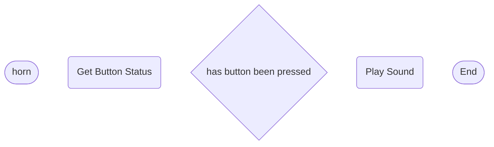

# Programming Logic

> For each behaviour, create the mermaid flowchart. Start each flowchart with a Heading naming the functionality. Delete this comment prior to submission.

## Logic 1

```mermaid
flowchart TD
    Start([horn])
    getButtonStatus(Get Button Status)
    checkButton{has button been pressed}
    soundHorn(Play Sound)
    finish([End])

```